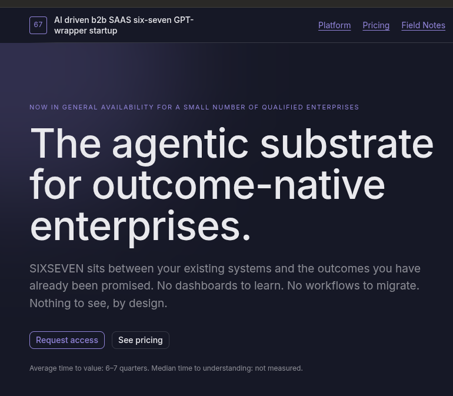
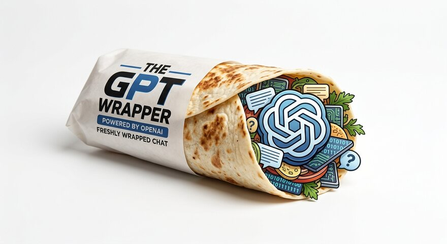

# AI driven b2b SAAS six-seven GPT-wrapper startup

> This is the source of **[ai-driven-b2b-saas.com](https://ai-driven-b2b-saas.com)**, which became public when a vibe coder shipped the repository instead of the site. The incident has been logged as zero-friction adoption and the responsible agent has been moved to the growth team.

**SIXSEVEN — the agentic substrate for outcome-native enterprises.** Category pending. Definition pending.

> **This is satire.** Sixseven Technologies, Inc. does not exist. Nothing here is a product, a security, or an offer. See [Disclaimer](#disclaimer).

---

## What this is

A fake enterprise AI vendor, built out to the level of detail that real enterprise AI vendors are built out to, and then one level past that.

The site sells SIXSEVEN: a platform your teams never open, producing outcomes your board can describe with growing confidence. Under the hood it is one model call, wrapped carefully — the site says so on the homepage, in the architecture table, and on slide four of the deck. Nobody has asked a follow-up.

Things the fiction commits to:

- **The 6/7 score.** A single number capturing your organisation's readiness across the dimensions that matter. It is scored out of seven. It has never exceeded six. The seventh dimension is not discussed, because the people who could discuss it are in a meeting.
- **Seven architecture layers**, published in full because transparency is a value and nobody reads past layer three. L3 is *Reasoning core: one model call*. L4 appends your company name to the prompt.
- **A quote calculator.** Move the inputs, the number moves; the relationship between those two facts is proprietary. All quotes are rounded to the nearest 67 and expire when read.
- **Four Field Notes** — a client who bought a second AI to summarise the first one's summaries, an agent given $10,000 that now has $2,000 and a plan, and two others.
- **A waitlist** that issues you a position number which is stable, personal, and entirely made up.
- **An "Invest in us\*" page.** The asterisk is the whole product. Valuation $0, equity offered 0.00%, board seats 0. It takes tips, not investment, and says so in seven numbered clauses.

The marketing site is engineered considerably more thoroughly than the product it describes. It is the only part of the joke that is not an exaggeration.

## Screenshots

The homepage, above the fold:

Figure 1 of the homepage — the architecture, to scale:

## Questions we are asked, and answer

**So it is a GPT wrapper?**
It is a substrate. A wrapper implies a single call passed through with light formatting. Ours is passed through with governance.

**How do I run it locally?**
It is a Laravel app. There were setup instructions in this file. They were removed for being the least funny thing in it.

**What does it actually do?**
It sits between things. Every customer describes this differently and all of them are correct.

**Is my data safe?**
Your data is in your region, in a copy, near another copy. Safety is a posture and our posture is excellent.

**Why is the Ukrainian version switched off?**
The translations were not good enough to ship, which we have reframed as a staged regional rollout.

**Are the crypto addresses real?**
Yes. So is the part where you receive nothing in return.

## Roadmap

Ordered by likelihood, which is not the same as by value.

- Bring the Ukrainian site back, in a form its speakers would defend.
- Ship to **ai-driven-b2b-saas.com**, at which point the repository being public becomes intentional and always was.
- Tests. There is a `tests/` directory and an intention.
- Dimension seven —

## Author

Oleg — [github.com/swayoleg](https://github.com/swayoleg)

Wrote the joke, then wrote the platform around it, which is the wrong order and the whole point.

## Licence

The application code is MIT. The site's copy, the Field Notes and the design are the author's; take the code, take the ideas, and write your own jokes.

## Disclaimer

This is a work of satire. **SIXSEVEN / Sixseven Technologies, Inc. is not a real company.** There is no product, no platform, no cohort, no waitlist, no round, no cap table and no seventh dimension. The customers, the testimonials, the logos, the team, the 67 open roles and the compliance attestations are all invented, and any resemblance to a real company, person or Series B is coincidental and, statistically, unavoidable.

The "Invest in us" page accepts **tips, not investments**. Nothing on it is a security, a share, a SAFE, a note, a token, a right to a future token, or a discount on any of the above. Sending money to any address on this site buys the author a coffee and creates no instrument, no obligation and no relationship. It is a tip, not a term sheet. Executed by nobody. Enforceable against nobody. Version 6.7.
